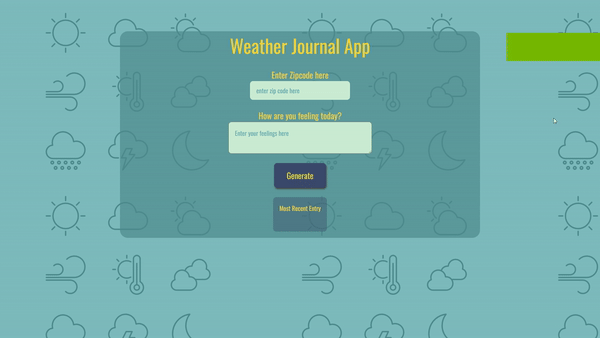

# Weather Journal App :cloud_with_rain:

### Project Objective

This project was about creating a web app that uses the OpenWeatherMap API to fetch weather data based on the user's Zip code and dynamically update the user interface using chain multiple promises, this project required working with Web APIs and asynchronous javascript.

#### Used Tech
- HTML 
- CSS
- Javascript (Vanilla)
- Node (server side)

### Demo
